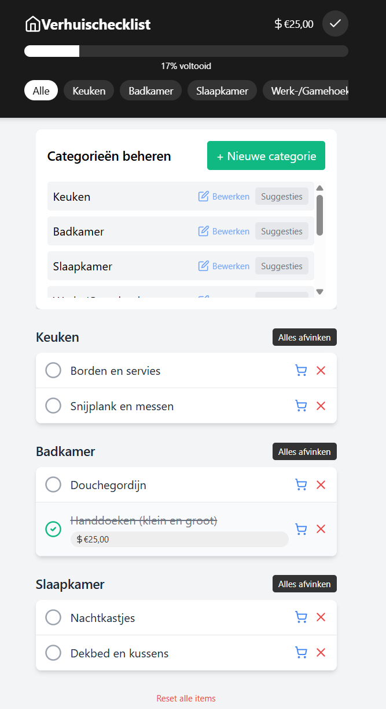

# 📦 Verhuischecklist

Een handige interactieve app om je verhuizing te organiseren en kosten bij te houden.

**Live demo:** [https://lindensec.github.io/verhuischecklist/](https://lindensec.github.io/verhuischecklist/)

## ✨ Functies

- 📋 Organiseer verhuisitems per categorie
- 💰 Houd kosten bij voor elk item
- 🔍 IKEA-integratie voor gemakkelijk zoeken naar producten
- 📊 Voortgangsindicator toont je progressie
- 💾 Automatisch opslaan in je browser
- 🌙 Modern, minimalistisch ontwerp
- 📱 Volledig responsive (werkt op mobiel, tablet en desktop)

## 🚀 Hoe te gebruiken

### Basis gebruik
1. **Items toevoegen**: Klik op de + knop rechtsonder om nieuwe items toe te voegen
2. **Items afvinken**: Klik op de cirkel naast een item om het af te vinken
3. **Kosten bijhouden**: Wanneer je een item afvinkt, kun je de kosten invullen
4. **Filteren**: Gebruik de categorieknoppen bovenaan om specifieke categorieën te bekijken
5. **Verbergen van afgevinkte items**: Klik op het vinkje in de rechterbovenhoek

### Geavanceerde functies
1. **Categorieën beheren**: Klik op de lijst-knop rechtsonder om categorieën toe te voegen of te bewerken
2. **Suggesties bekijken**: Elke categorie bevat suggesties voor veelvoorkomende items
3. **IKEA zoeken**: Klik op het winkelwagen-icoon naast een item om direct op IKEA te zoeken
4. **Voortgang bekijken**: De voortgangsbalk bovenaan toont hoeveel procent van je lijst is voltooid
5. **Totaalkosten**: De totale uitgaven worden bovenaan getoond

## 💻 Technologie

De Verhuischecklist is gebouwd met:
- HTML5, CSS3 en JavaScript
- React (via CDN)
- Tailwind CSS voor styling
- LocalStorage voor het opslaan van gegevens

## 🤝 Bijdragen

Verbeteringen zijn altijd welkom! Om bij te dragen:
1. Fork de repository
2. Maak je wijzigingen
3. Stuur een pull request

## 📱 Privacy

De Verhuischecklist slaat alle gegevens lokaal op in je browser. Er worden geen gegevens naar een server gestuurd of met derden gedeeld.

## 📄 Licentie

Dit project is beschikbaar onder de MIT-licentie.

---

Gemaakt met ❤️ voor iedereen die gaat verhuizen!
